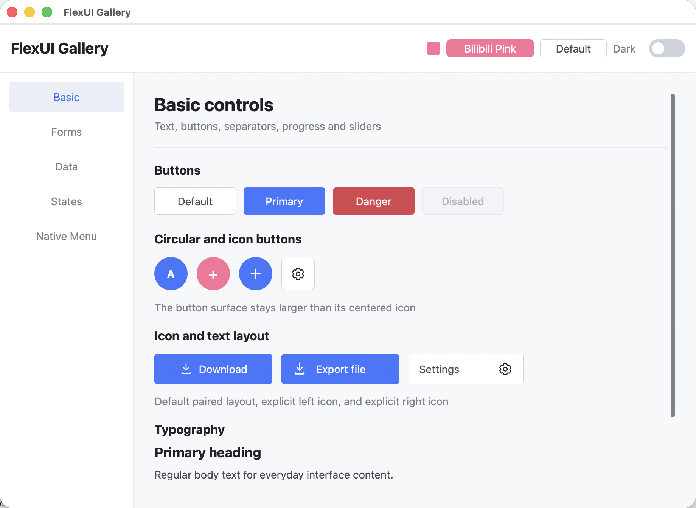
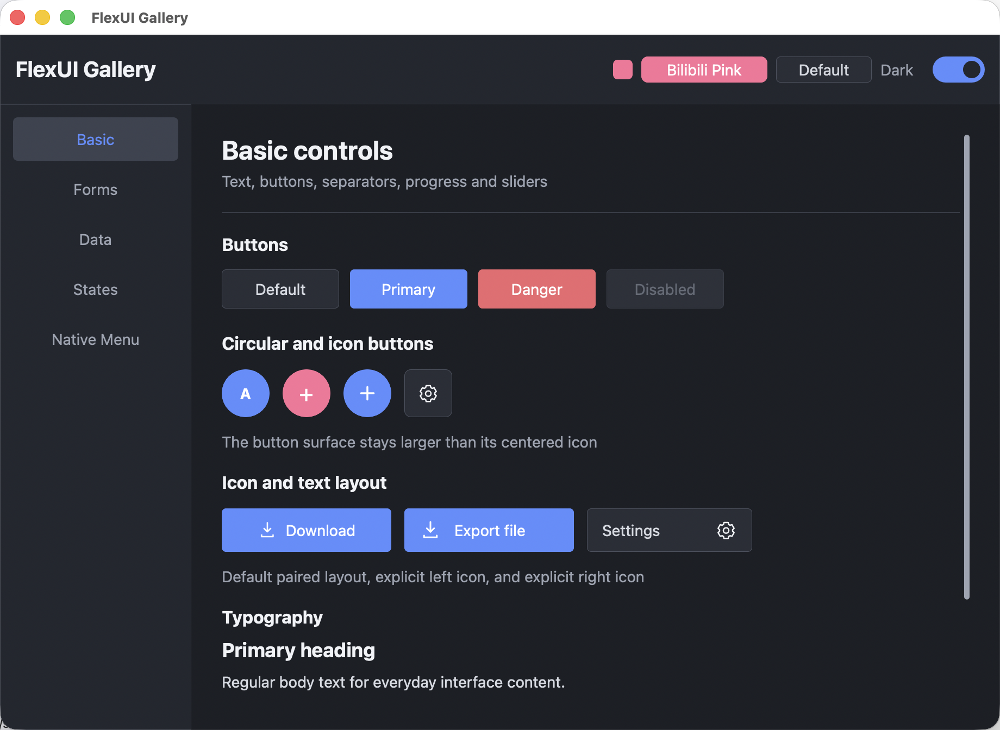
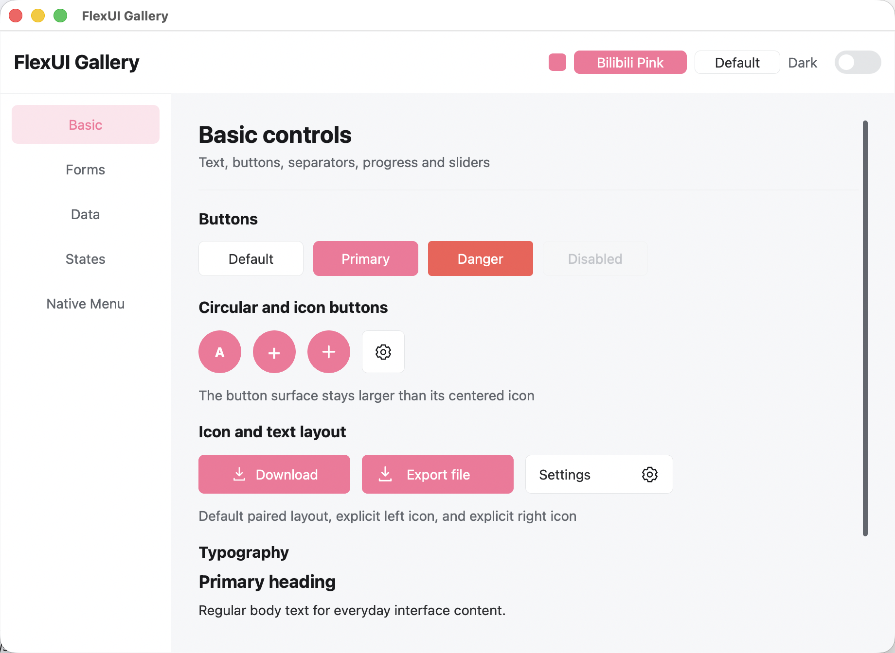
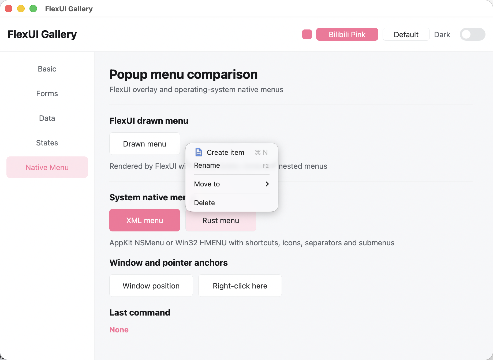
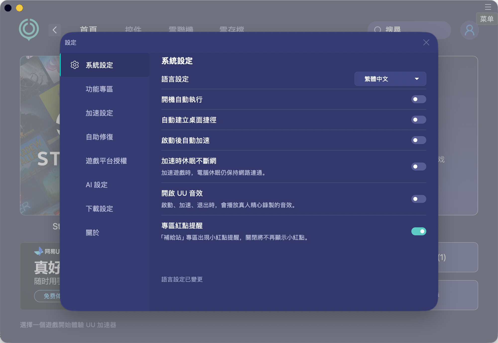
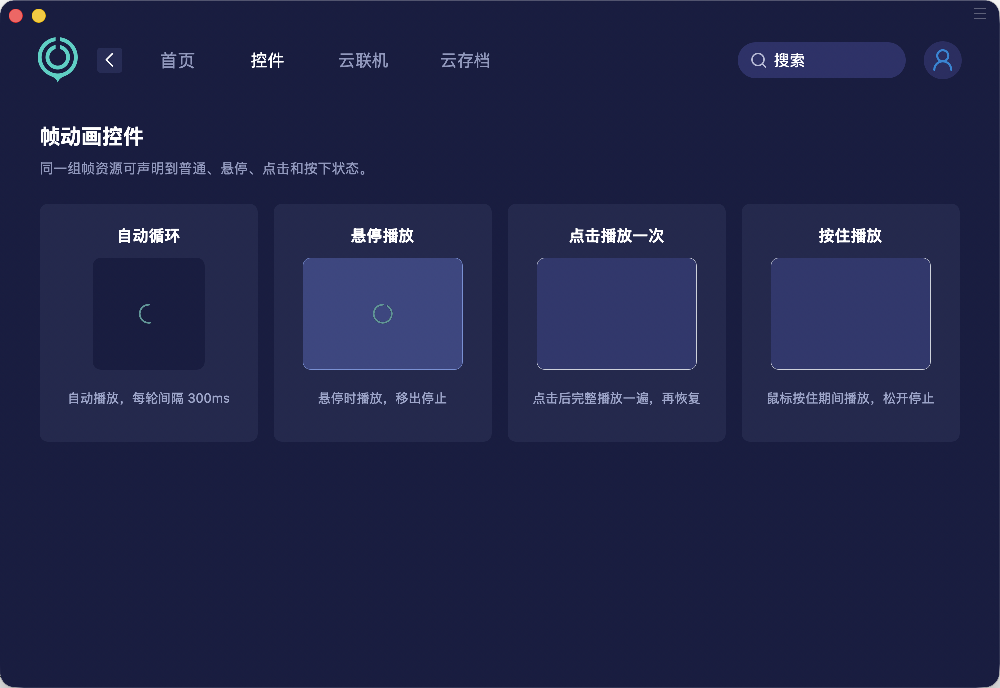

# FlexUI

Cross-platform desktop UI framework for Rust, with native windows, a custom-rendered widget tree, XML layouts, and a pure Rust API.

[简体中文](README_zh.md) | English

> [!IMPORTANT]
> FlexUI is in active early development (`0.0.x`). It is already suitable for experiments and internal tools, but APIs may change before the first stable release.

<p align="center">
  
  
</p>

FlexUI keeps application code in Rust while using the operating system where it matters: AppKit/CoreGraphics on macOS, Win32/GDI+ on Windows, and X11/Cairo/Pango on Linux. Layout, controls, state handling, theming, and rendering share one platform-independent core.

## Highlights

- **Two authoring styles**: compose interfaces with XML or build the same widget tree with Rust.
- **Native desktop windows**: multi-window and modal workflows, system title bars, custom title bars, DPI handling, IME, clipboard, drag and drop, and native file dialogs.
- **Practical layout system**: `VBox`, `HBox`, `Panel`, `ScrollView`, and `TabBox`, with fixed/content/fill sizing, flex growth, alignment, padding, margin, and absolute positioning.
- **Built-in controls**: labels, images, buttons, edits, checkboxes, switches, radios, combo boxes, sliders, progress bars, list views, separators, scrolling, and menus.
- **State-aware styling**: normal, hot, pushed, disabled, focused, selected, and combined states. Colors, borders, images, gradients, shadows, opacity, and text alignment can all vary by state.
- **Theme system**: light and dark defaults, semantic color tokens, component recipes, variants, classes, and runtime theme switching.
- **Resource-first rendering**: PNG, JPEG, and SVG; density-aware `@2.00x` assets; center, stretch, and nine-patch fitting; directory, ZIP, and embedded ZIP providers.
- **Frame animation**: loop, hover, click-once, and press-to-play modes, with frame timing, pause/resume, and loop intervals.
- **Localization**: JSON catalogs and Apple String Catalogs, locale fallback, interpolation, plurals, and runtime language switching.
- **Menus for both worlds**: FlexUI-drawn overlay menus and operating-system native menus with icons, shortcuts, separators, and submenus, created from XML or Rust.
- **C ABI layer**: `flexui-ffi` provides `cdylib` and `staticlib` outputs for non-Rust hosts.

## Gallery

The gallery demonstrates controls without image skins, including the built-in themes and a custom `#FB7299` theme.

<p align="center">
  
  
</p>

```bash
cargo run -p flexui-gallery
cargo run -p flexui-gallery -- --dark
```

## Complex UI Example

`flexui-examples` is a skin-heavy application used to exercise real desktop workflows: included XML pages, image resources, custom window chrome, popup menus, modal login/settings windows, localization, and frame animation.

<p align="center">
  
  
</p>
<p align="center">
  
  
</p>
<p align="center">
  
  
</p>

```bash
cargo run -p flexui-examples
```

The example recreates a third-party product interface strictly as a framework rendering test; it is not an official client or affiliated project.

## Quick Start

### Prerequisites

- A current stable Rust toolchain
- macOS, Windows, or Linux with X11
- Platform build tools: Xcode Command Line Tools on macOS, a Rust-compatible Windows C/C++ toolchain on Windows, or Cairo/Pango/X11 development packages on Linux

Clone the repository and run the gallery:

```bash
git clone https://github.com/cn-ygf/flexui-rs.git
cd flexui-rs
cargo run -p flexui-gallery
```

### Minimal XML Window

```rust
use flexui::{Skin, Window, WindowCtx, WindowImpl};

struct HelloWindow;

impl WindowImpl for HelloWindow {
    fn skin(&self) -> Skin {
        Skin::xml(
            r#"
            <Window title="FlexUI" width="420" height="240">
              <VBox padding="24" spacing="16" align="center" justify="center">
                <Label text-verbatim="Hello from FlexUI" font-size="24" bold="true"/>
                <Button name="close" text-verbatim="Close" variant="primary"
                        width="120" height="40"/>
              </VBox>
            </Window>
            "#,
        )
    }

    fn on_click(&mut self, name: &str, ctx: &mut WindowCtx) {
        if name == "close" {
            ctx.close();
        }
    }
}

fn main() {
    Window::new(HelloWindow).center().run();
}
```

### UI-Thread Dispatch and Window Lifecycle

`MainProxy` is runtime-independent. Clone it during initialization, then call `post` after a
thread or async task finishes. The closure runs on the owning window's UI thread, and normal
`WindowCtx` setters automatically request paint or layout invalidation.

```rust
fn on_init(&mut self, ctx: &mut WindowCtx) {
    let ui = ctx.main_proxy().expect("window proxy");
    std::thread::spawn(move || {
        let result = load_data();
        ui.post(move |ctx| {
            ctx.set_text("status", result);
            ctx.set_enabled("retry", true);
        });
    });
}
```

The same `post` call can be made after `.await` inside Tokio, async-std, or another executor;
FlexUI does not require a particular async runtime. Window hooks are ordered as
`on_before_init` → `on_init` → `on_initialized` → `on_closing` → `on_closed`.
`on_closing` can return `false` to cancel closing. `on_closed` has no `WindowCtx`, because the
native window has already been destroyed. Minimize, maximize, and restore notifications arrive
through `on_window_event` as `WindowEvent::Minimized`, `Maximized`, and `Restored`.

Inside this workspace, depend on the facade crate with:

```toml
[dependencies]
flexui = { path = "../flexui-rs/crates/flexui" }
```

FlexUI is not published on crates.io yet.

## XML at a Glance

XML is optional, but useful for skin-heavy interfaces and designer/developer separation.

```xml
<Window title="Demo" width="720" height="480" titlebar="system">
  <VBox width="fill" height="fill">
    <HBox height="56" padding="16" align="center" bgcolor="@surface">
      <Label text-verbatim="Dashboard" width="fill" font-size="20" bold="true"/>
      <Switch name="dark_mode" width="44" height="24"/>
    </HBox>
    <TabBox name="pages" bindgroup="1" width="fill" height="fill">
      <Include src="pages/home.xml"/>
      <Include src="pages/settings.xml"/>
    </TabBox>
  </VBox>
</Window>
```

State prefixes can be combined, for example `hot-bgcolor`, `focus-bordercolor`, `selected-fgcolor`, or `hot-focus-bgimage`. Runtime property updates automatically request the appropriate paint or layout invalidation.

## Platform Backends

| Capability | macOS | Windows | Linux |
| --- | --- | --- | --- |
| Native window | AppKit `NSWindow` + custom `NSView` | Win32 window | X11 (`x11rb`) |
| Rendering | CoreGraphics-backed canvas | GDI+ | Cairo + Pango |
| Native menus | AppKit menu | Win32 menu | X11 override-redirect menu |
| Clipboard, IME, file dialogs | Supported | Supported | Supported |
| Custom/system title bars | Supported | Supported | Supported |
| File drag and drop | Supported | Supported | Supported (Xdnd/XWayland) |
| System tray example | Supported | Supported | Supported (StatusNotifierItem) |

## Workspace Layout

| Crate | Responsibility |
| --- | --- |
| `flexui` | Public facade and platform selection |
| `flexui-core` | Widget tree, layout, events, styles, themes, animation |
| `flexui-xml` | XML parsing, includes, bindings, and window documents |
| `flexui-macos` / `flexui-windows` / `flexui-linux` | Native windows, input, and rendering backends |
| `flexui-gfx` | Canvas contracts and geometry primitives |
| `flexui-resource` / `flexui-svg` | Resource providers and SVG rasterization |
| `flexui-i18n` | Localization catalogs, fallback, and plurals |
| `flexui-native-menu` | Cross-platform system popup menus |
| `flexui-ffi` | C ABI outputs |
| `flexui-gallery` | Theme and control gallery |
| `flexui-examples` | Complex XML/resource application example |

## Documentation

- [XML layout and widget property reference](docs/XML布局与控件属性参考.md) (Chinese)
- [Localization guide](docs/i18n.md) (Chinese)
- Browse [`crates/flexui-gallery`](crates/flexui-gallery) for theme and control examples.
- Browse [`crates/flexui-examples`](crates/flexui-examples) for multi-window, resource, menu, localization, and animation examples.

## Build and Test

```bash
cargo test --workspace --all-targets
cargo check --workspace --all-targets
./scripts/gui-smoke.sh
```

The smoke script opens a real native window, posts a close request from a background thread, and
checks the complete lifecycle callback order. On a headless Linux host it automatically uses
`xvfb-run`; on Windows, run `powershell -ExecutionPolicy Bypass -File scripts/gui-smoke.ps1`.

Build an ad-hoc signed macOS application bundle for the complex example:

```bash
./scripts/build-macos-app.sh
open target/release/bundle/macos/FlexUIExamples.app
```

## License

FlexUI is available under the [MIT License](LICENSE).
